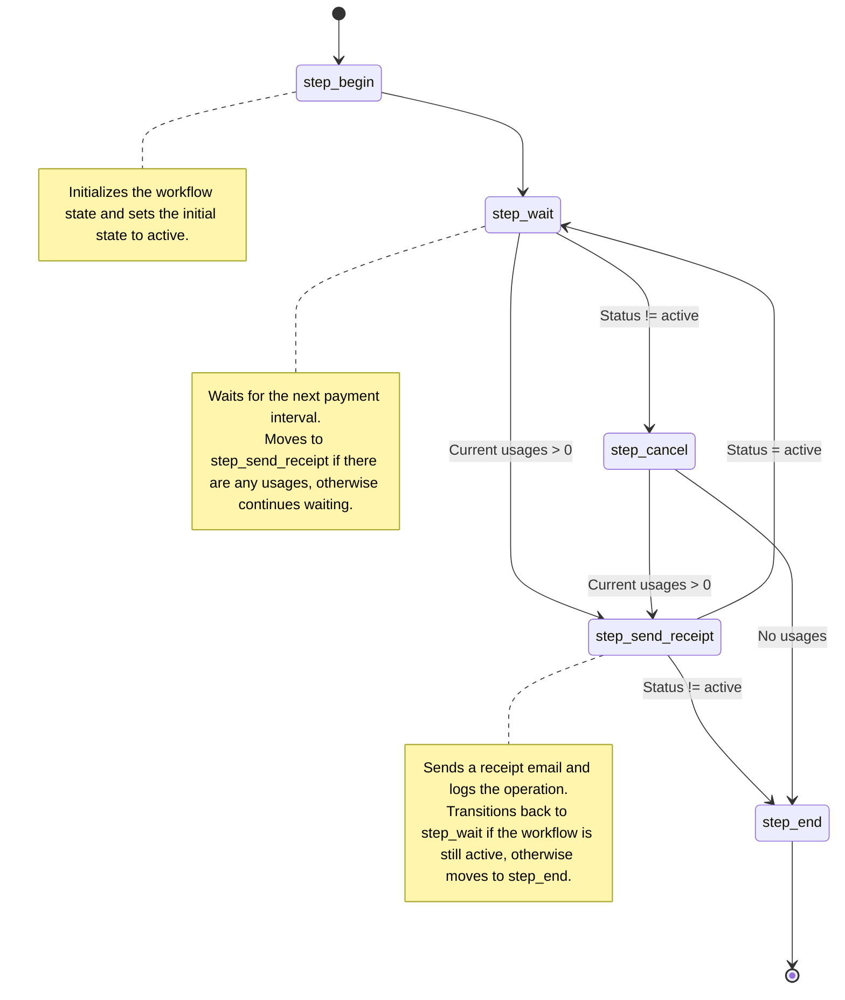

# Subscription payment with Tiny Workflow

This guide will help you get started with the **tiny-workflow** package by walking you through setting up and running an example workflow.

## Prerequisites

Ensure you have the following tools installed:
- [Bun](https://bun.sh/)

## Installation

First, clone the repository and install the dependencies:

```bash
git clone https://github.com/your-username/tiny-workflow.git
cd tiny-workflow
bun install
```

## Targets

For this quick start, we will use the `intervalPayment` example which demonstrates a subscription workflow:

- Collect the usage, create a receipt, and send email for cycles.
- Workflow (per customer) can be create, run, resumed, and persisted as JSON.

## Understanding the Code

The `intervalPayment.ts` script defines a workflow class `IntervalPaymentFlow` which extends `DurableState` with the following generic types:

```ts
class IntervalPaymentFlow extends DurableState<EStep, TStateShape, EAuditLog> {...}
```

### Enumerations and Types

```ts
enum EStep {
  step_begin = "step_begin",
  step_wait = "step_wait",
  step_send_receipt = "step_send_receipt",
  step_cancel = "step_cancel",
  step_end = "step_end",
}

type UsageItem = {
  item: string;
  amount: number;
};

type ReceiptItem = {
  cycle: number;
  createdAt: number;
  usages: UsageItem[];
  deliveryId?: string;
};

// Defines the shape of the workflow state
type TStateShape = {
  // User email address for sending receipts
  userEmail: string;

  // Interval in milliseconds for each payment cycle
  paymentIntervalMs: number;

  // Internal variable to keep track of the current cycle number
  _cycle: number;

  // Timestamp for the next payment cycle
  _nextPaymentAt: number;

  // Subscription status to determine if the workflow is active or cancelled
  status: "active" | "cancel";

  // List of current usage items for the ongoing cycle
  currentUsages: UsageItem[];

  // List of all receipts generated through different cycles
  receipts: Array<ReceiptItem>;
};


type EAuditLog = "set_param" | "add_usage" | "bill_sent" | "cancel";
```

### Workflow Steps

- **step_begin**: Initializes the state and moves to `step_wait`.

- **step_wait**: Waits for the next payment interval. If there are usages, creates a receipt and moves to `step_send_receipt`. If canceled, moves to `step_cancel`.

- **step_send_receipt**: Sends a receipt email, logs the operation, and moves back to `step_wait` if active, otherwise to `step_end`.

- **step_cancel**: Cancels the workflow and sends any remaining receipts. Moves to `step_end`.

- **step_end**: Ends the workflow.


### Actions

The `IntervalPaymentFlow` class includes two primary actions: `actionAddUsage` and `actionCancel`.

#### actionAddUsage

Adds a usage item to the current cycle. It ensures the workflow is active before adding the item to the `currentUsages` array and logs the action.

```ts
actionAddUsage(usageItem: UsageItem) {
  if (this.state.status != "active")
    throw new Error("status is not active. can not process");

  this.state.currentUsages.push({ ...usageItem });
  this.addLog({
    type: "add_usage",
    values: {
      ...usageItem,
    },
  });
}
```

#### actionCancel

Cancels the current workflow by setting its status to "cancel" and logs the action. This is typically invoked when the user chooses to end their subscription.

```ts
actionCancel() {
  if (this.state.status != "active")
    throw new Error("status is not active. can not process");

  this.state.status = "cancel";

  this.addLog({
    type: "cancel",
    values: {},
  });
}
```

### Context and Runtime

A `MemContext` class extends `SimpleContext` for managing the workflow instances and persistence. The `WorkflowRuntime` class is used to manage and execute workflow instances.

## Running the Example

Run the following command to start the `intervalPayment` workflow:

Output

```bash
bun run examples/flows/intervalPayment.ts
 [ 🔒 ] - run_info@company.com
[DurableState][run_info@company.com][step_begin] start
[DurableState][run_info@company.com][step_wait] wait for cycle_no= 0
[DurableState][run_info@company.com][step_wait] end
 [ 🗝️ ] - run_info@company.com
🤟 Wellcome info@company.com to IntervalPayment 🤟

  /state:         print state as json
  /add [num]:     add a random usage. default num=1
  /save:          save storage to file
  /cancel:        cancel
  /exit:          exit

/add 3
 [ 🔒 ] - run_info@company.com
add usage id_19 - 1
add usage id_42 - 9
add usage id_90 - 10
 [ 🗝️ ] - run_info@company.com
 [ 🔒 ] - run_info@company.com
[DurableState][run_info@company.com][step_wait] start
[DurableState][run_info@company.com][step_wait] inc cycle_no= 1 nextCheck= 1723991753520
[DurableState][run_info@company.com][step_send_receipt] Send bill for cycle_no=0 to email=info@company.com, receipt={"cycle":0,"createdAt":1723991743520,"usages":[{"item":"id_19","amount":1},{"item":"id_42","amount":9},{"item":"id_90","amount":10}]}
[DurableState][run_info@company.com][step_wait] wait for cycle_no= 1
[DurableState][run_info@company.com][step_wait] end
 [ 🗝️ ] - run_info@company.com
/state
{
  step: "step_wait",
  state: {
    userEmail: "info@company.com",
    paymentIntervalMs: 10000,
    status: "active",
    _cycle: 1,
    _nextPaymentAt: 1723991753520,
    currentUsages: [],
    receipts: [
      [Object ...]
    ],
  },
  runtimeUsage: {
    total: 4,
    done: 0,
  },
}
/cancel
 [ 🔒 ] - run_info@company.com
canceled
 [ 🗝️ ] - run_info@company.com
 [ 🔒 ] - run_info@company.com
[DurableState][run_info@company.com][step_wait] start
[DurableState][run_info@company.com][step_end] end
 [ 🗝️ ] - run_info@company.com
all done
db synced:  intervalPayment_db.json
```

Happy coding!
